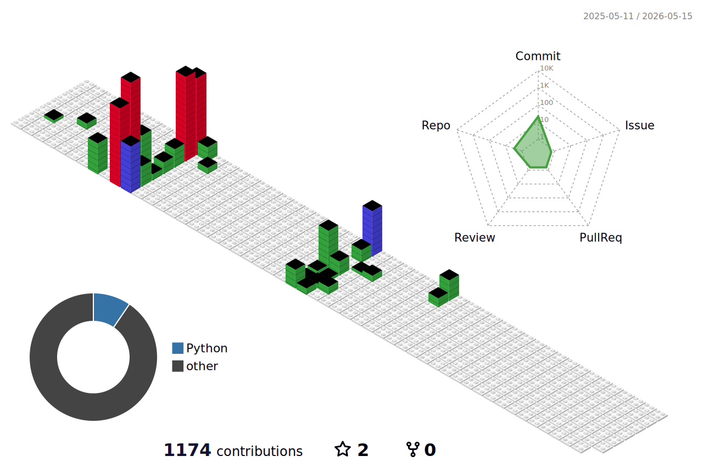

- 👋 Hi, I'm Miike!
- 📫 You can reach me at miike@miike7.com
<!---

- 👀 I'm interested in a variety of topics, including cloud computing, Minecraft servers, cybersecurity, programming, electronics, and many others.
- 🌱 I'm currently working on ----
- 🐍 I know Python, C# & C++.
- 🔧 I'm a SysAdmin.
--->


# 🛠️ Tools
<!---
## 🌐 Browser


## 📂 Cloud Storage


--->

## 💾 Databases


<!---
## 🎨 Design


## 🧑‍💻 Developer/Forums


--->

## 📚 Frameworks, Platforms and Libraries


## ☁️ Hosting/SaaS


## 💻 IDEs/Editors


## 🎛️ OS


<!---
## 🤖 AI

--->

## 🗄️ Servers


## 🥅 Others


<!---
# Skills
[](https://github.com/harish-sethuraman/readme-components)
[](https://github.com/harish-sethuraman/readme-components)
[](https://github.com/harish-sethuraman/readme-components)
[](https://github.com/harish-sethuraman/readme-components)
[](https://github.com/harish-sethuraman/readme-components)
[](https://github.com/harish-sethuraman/readme-components)
[](https://github.com/harish-sethuraman/readme-components)
[](https://github.com/harish-sethuraman/readme-components)
[](https://github.com/harish-sethuraman/readme-components)
[](https://github.com/harish-sethuraman/readme-components)
--->


# Stats


<!--START_SECTION:waka-->


**🐱 My GitHub Data** 

> 📦 3.8 MB Used in GitHub's Storage 
 > 
> 🏆 0 Contributions in the Year 2026
 > 
> 💼 Opted to Hire
 > 
> 📜 19 Public Repositories 
 > 
> 🔑 16 Private Repositories 
 > 
**I'm an Early 🐤** 

```text
🌞 Morning                992 commits         ██████░░░░░░░░░░░░░░░░░░░   22.99 % 
🌆 Daytime                1229 commits        ███████░░░░░░░░░░░░░░░░░░   28.49 % 
🌃 Evening                645 commits         ████░░░░░░░░░░░░░░░░░░░░░   14.95 % 
🌙 Night                  1448 commits        ████████░░░░░░░░░░░░░░░░░   33.57 % 
```
📅 **I'm Most Productive on Friday** 

```text
Monday                   697 commits         ████░░░░░░░░░░░░░░░░░░░░░   16.16 % 
Tuesday                  41 commits          ░░░░░░░░░░░░░░░░░░░░░░░░░   00.95 % 
Wednesday                114 commits         █░░░░░░░░░░░░░░░░░░░░░░░░   02.64 % 
Thursday                 267 commits         ██░░░░░░░░░░░░░░░░░░░░░░░   06.19 % 
Friday                   1479 commits        █████████░░░░░░░░░░░░░░░░   34.28 % 
Saturday                 883 commits         █████░░░░░░░░░░░░░░░░░░░░   20.47 % 
Sunday                   833 commits         █████░░░░░░░░░░░░░░░░░░░░   19.31 % 
```


📊 **This Week I Spent My Time On** 

```text
🕑︎ Time Zone: Europe/Paris

💬 Programming Languages: 
No Activity Tracked This Week
```

**I Mostly Code in Python** 

```text
Python                   5 repos             ██████░░░░░░░░░░░░░░░░░░░   22.73 % 
Java                     3 repos             ███░░░░░░░░░░░░░░░░░░░░░░   13.64 % 
C++                      2 repos             ██░░░░░░░░░░░░░░░░░░░░░░░   09.09 % 
Roff                     1 repo              █░░░░░░░░░░░░░░░░░░░░░░░░   04.55 % 
C#                       1 repo              █░░░░░░░░░░░░░░░░░░░░░░░░   04.55 % 
```


**Timeline**


 Last Updated on 07/04/2026 19:38:25 UTC
<!--END_SECTION:waka-->




